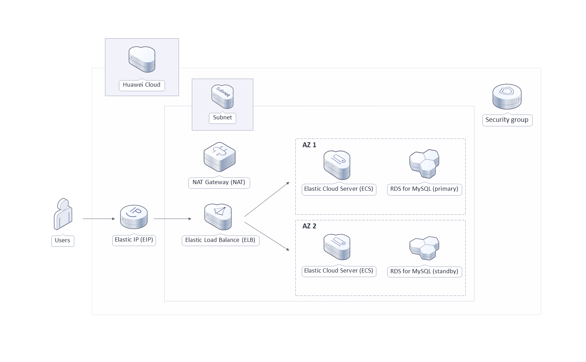
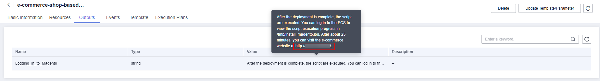
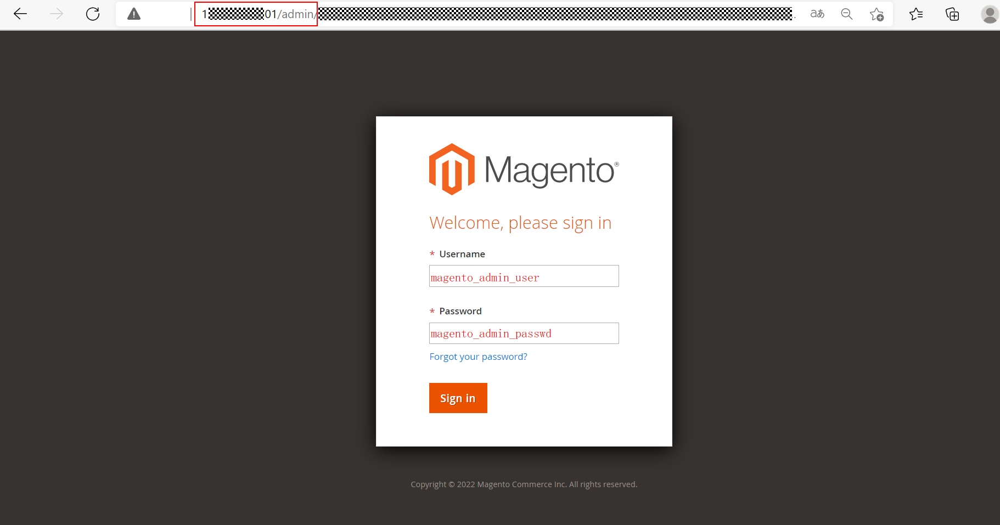
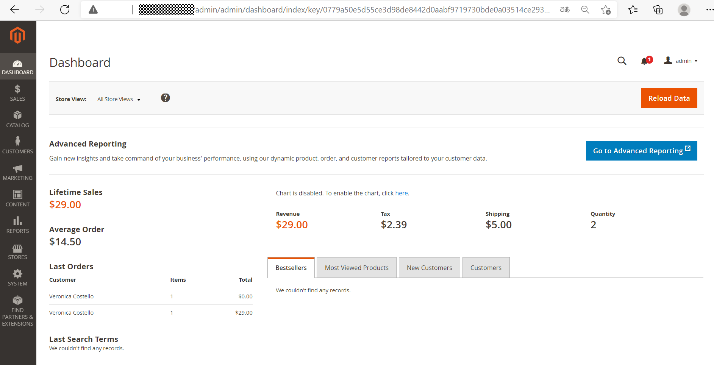
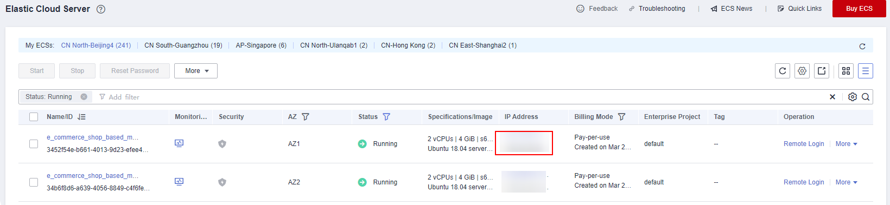
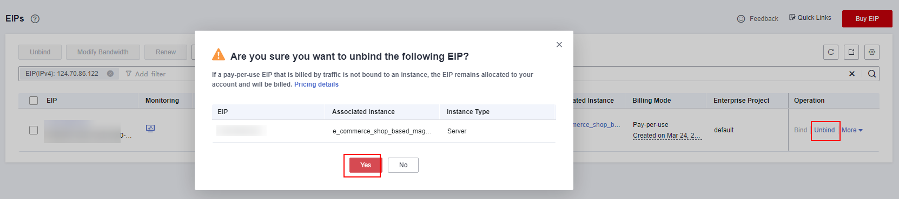
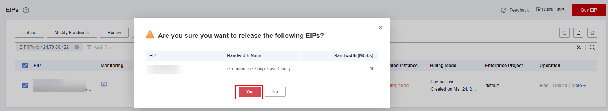

[TOC]

**Solution Overview**
===============
This solution helps you quickly build a fully-feature, easy-to-manage, and highly available Magento-based e-commerce website on Huawei Cloud. Magento is an open-source e-commerce platform with a modular architecture and many features on table. This solution applies to the following scenarios:

- Online sellers with retail experience and hope to build up their own brands and stores
- Traditional retailers with stores in many locations but who want to expand online retail channels
- Vendors who run online stores that serve customers directly
**Solution Architecture**
---------------


**Architecture Description**
---------------
To use this solution, you need to deploy the following cloud resources:

- Two elastic cloud servers (ECSs) for the e-commerce platform to improve fault recovery and availability
- A security group to control incoming and outgoing traffic to and from ECSs
- A load balancer with an EIP bound to distribute incoming traffic to the two ECSs and RDS instances
- A public NAT gateway with an SNAT rule added to allow Magento applications to securely access the Internet
- Two RDS for MySQL instances deployed as a primary/standby pair for the e-commerce platform database

**File Structure**
---------------
``` lua
huaweicloud-solution-E-commerce-shop-based-magento
├── e-commerce-shop-based-magento-enhanced.tf.json -- Resource orchestration template (enhanced level)
├── e-commerce-shop-based-magento-entry.tf.json -- Resource orchestration template (entry level)
├── e-commerce-shop-based-magento-standard.tf.json -- Resource orchestration template (standard level)
├── userdata
	├── install_magento.sh  -- Script configuration file
```
**Using Magento to Build an E-Commerce Website**
---------------
1. On the **Output** tab page of the stack, copy the address for accessing Magento.

	Figure 1 Address for accessing Magento
	

2. Open the browser, paste the copied address into the address box, and press **Enter**. The following figure shows the client page of Magento.

	Figure 2 Magento client
	

3. Open the browser, add **/admin** to the end of the copied address in the address box, and press **Enter**. The following figure shows the administrator login page of Magento.

	Figure 3 Magento login as an administrator
	

4. The following figure shows the backend management page, on which you can perform routine Q&M on your online stores.

	Figure 4 Magento backend management
	

5. Log in to the ECS console, locate the ECSs you want to unbind the EIPs from. In the Operation column of each ECS, choose More > Manage Network > Unbind EIP. On the displayed dialog box, click Yes.

	Figure 5 Viewing an EIP
	

	Figure 6 Unbinding an EIP
	

6. Release the EIPs. Log in to the EIP console, locate the EIPs you want to release and choose More > Release in the Operation column of each EIP.

	Figure 7 Releasing an EIP
	

Refer to the [deployment guide](https://support.huaweicloud.com/intl/en-us/esbm-internet/esbm_01.html) for more information.


